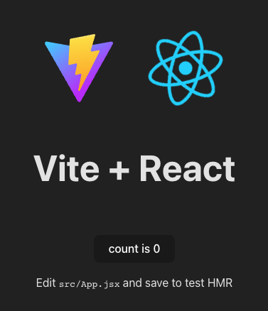

# "Hello World" in React!

## Learning Objectives

1. Create a new React application using Vite and explain its key file structure.
2. Demonstrate the use of JSX to combine JavaScript and HTML-like markup in React components.
3. Apply JavaScript logic within JSX using curly braces to create dynamic content.

## <a href="https://react.dev/reference/react-dom/client/createRoot#usage" target="_blank">Hello World</a>

In this section you should begin to understand that React applications are bound to a single root, this code is generated when we start a new React application using <a href="https://vitejs.dev/guide/" target="_blank">Vitejs</a>. Give this a shot yourself and generate a new React application with <a href="https://vitejs.dev/guide/" target="_blank">Vitejs</a>, you should be able to see a similar file structure to the official documentation above.

To create a new React application using Vite, open up your CLI tool and run this command in the directory where you want to create your application:

`npm create vite@latest`

You will be prompted to input a name.

Then you will be asked what type of application you want to create, use your arrow keys to navigate to 'React' and press 'enter'.

Then using arrow keys once more navigate down to 'JavaScript', if you don't need standard build tools later in development you can choose 'JavaScript + SWC' and click enter.

Now you can follow the instructions within the CLI to first navigate into the newly created directory, then install the required dependancies and finally run the React application using the command `npm run dev`, to view the application you should open the URL that is shown in your CLI, it should be something like <a href="http://localhost:5173/" target="_blank">**http://localhost:5173**</a>, the output on the page should be similar to the image below. 

<figure><figcaption><p>Vite and React</p></figcaption></figure>

There are some key files that you should be aware of within this starter code. Note that the index.html is in the root of the project directory, it is in the entry point to your application and is required for the React App. Please explore the files within the starter code and consider the points below,

1. Within the src/main.jsx file `document.getElementById('root')` is a DOM (Document Object Model) command that retrieves the HTML element with ID "root". React renders our app inside that element. React removes the need to write DOM code and the above command is the only DOM command we will need.
2. <mark style="color:red;">**Note**</mark> that if you want to add and use images within your Vite React applications please add the images into the `public` directory and import as usual.
3. Familiarise yourself with as many of the provided examples as you can to understand and digest the relevant concepts
4. Try to complete the "Learn React" guide before attempting the "Tutorial: Tic Tac Toe" so the tutorial's concepts sink in better.

## <a href="https://react.dev/learn/writing-markup-with-jsx" target="_blank">Introducing JSX</a>

JSX or JavaScript and XML affords developers the opportunity to write HTML-like markup within a JavaScript or JSX file. Without using JSX developers would be forced to utilise React <a href="https://react.dev/reference/react/createElement" target="_blank">createElement</a>, this is less readable and intuitive than JSX. By employing JSX we can combine rendering logic alongside markup within what developers name components. While JSX looks like HTML it is stricter and can display dynamic information. It should be noted that JSX has its own rules that should be followed.

1. JSX elements may only return a single root element, to display multiple elements just wrap them within a single parent tag.
2. Close all HTML tags.
3. DOM stands for "Document Object Model", which is a JavaScript representation of HTML rendered on a web page. Frontend frameworks like React use the DOM to programmatically manipulate UI without manually specifying HTML. You can read through <a href="https://www.w3schools.com/js/js_htmldom.asp" target="_blank">W3School's intro to JavaScript HTML DOM</a> (just the 1st page) for a primer.

4. Use camelCase for most if its props,<a href="https://react.dev/learn/writing-markup-with-jsx#3-camelcase-salls-most-of-the-things" target="_blank"> click here for more details</a>. To apply CSS classes to JSX elements we will need to use the `className` keyword instead of `class`, which we used with vanilla HTML. This is because `class` is a reserved keyword in JS used to declare classes.

## <a href="https://react.dev/learn/javascript-in-jsx-with-curly-braces" target="_blank">JavaScript in JSX</a>

Within JSX, "{ }" or "curly braces" allow developers to write and execute JavaScript bound to the HTML-like code. This makes JSX more dynamic than HTML and allows for data binding basically straight out of the box.

1. When you want to add JavaScript logic or code into JSX you are able to do so by using curly braces within the JSX. Think of these using these braces { } like a window into the world of JavaScript.
2. You can pass string attributes to JSX, do this using single or double quotations.
3. You can only use curly braces as text directly within a JSX tag **OR** as attributes immediately following the `=` sign.
4. You should use double curly braces in some instances when writing JSX. Such as using inline CSS or passing a js object into a JSX element. 

React follows what we call a "declarative" UI paradigm, where we tell our computers how the UI should look, but not how to achieve that look. The declarative paradigm is a layer on top of the "imperative" paradigm of DOM manipulation more commonly used before React.


## Code application

Clean up all JSX code in between the `<div>` elements in `App.jsx`.

```js
import './App.css'

function App() {

  return (
    <>
      <div>
        <h1>Hello World!</h1>
      </div>
    </>
  )
}

export default App

```

Save all files and run `npm run dev` to make sure the template works and you're good to go!

### Activity (5 mins)

Modify `App.jsx` to include a short profile about yourself (3 to 5 sentences about yourself and your aspirations)

## Part 2 - JSX Demo (To Do List)

To accomplish this part, instructor should demonstrate using the following JSX to create a functional component. Edit `App.jsx` to accommodate the following JSX code.

```html
  <h1>                      // Big title "Todo App"
  <div></div>               // List item
  <input type='checkbox'>   // Check box for each task
  <label>                   // Task label
```
### Demo

Create a `MyComponent` component and import into `App.jsx`

### Activity (10 mins)

Create a `ToDoList` component in the `./src` folder and import it into `App.jsx`. Use the JSX learned in this section to create the component.

> Instructors may refer to `code/my-app/src/App.jsx` for code sample

## Part 3 - JSX Rules and Features

### Fragments 

This will be a simple demonstration of using `<>` and `</>` fragment. Fragments are used to group elements together in a parent node. Note how React would return errors if two parent nodes are used without fragments. Normally, we would use `<div></div>` tags for JSX fragments.

### *camelCase* Code Style

JSX is converted into native JavaScript (JS) and attributes written in JSX that will become keys in JS objects. As JS has limitation on variable names, e.g. they cannot contain dashes or reserved words. HTML attributes needs to be adapted to work around these limitations: 
- HTML `class` attribute shall be `className`, to avoid clashing with reserved JS `class` keyword.
- Dashes shall be removed and replaced with an initial capital, e.g. `background-color` shall be `backgroundColor`.

### Self-closing Tags

Not really a JSX rule, but self-closing tags are quite commonly used when inserting components with no content in React. It's basically a short-hand way of writing the closing tag, for example:
```jsx
<MyComponent></MyComponent>

//...is the same as ...

<MyComponent />
```

### Embedding JS Expressions

In JSX, you can combine standard HTML syntax with JS, by enclosing the JS code within curly braces `{}`. 

Here's an example of using JS to do some calculations:

```js
...
return (
  <div>
    <p>Here's a math expression: 23 * 78 is {23 * 78}</p>
  </div>
);

```
### Activity

1. Create a `MyExpressions` component and import into `App.jsx` (see above for a recap).
2. Use embedded JS to code the following expressions in your return JSX statement:
   - A math operation, e.g. +, -, * or /
   - A math library function, e.g. Math.sqrt()
   - Conditional/ternary operator
   - Looping with array methods, e.g. array.map(), array.forEach()