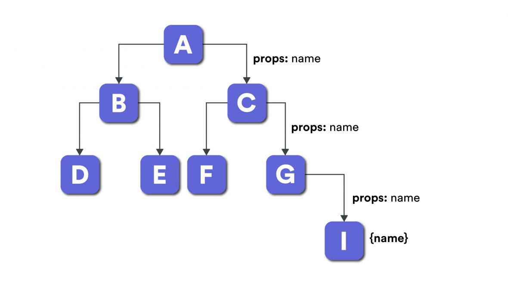

# useContext

## Learning Objectives

1. Use React Context to access shared state from our components without passing props
2. Learn how to use `useContext` to simplify syntax when using context with functional components

## Introduction

For most general use cases, managing state with the `useState` hook is sufficient, as it is easy to implement with little code overhead. As your project grows bigger and becomes more complex, relying solely on `useState` for state management may introduce code bloat and you might end up with *spaghetti code*.

In a React application, data is passed top-down, from parent --> child via props. Imagine a component tree with several layers of child components with a parent component at the top that holds the state variables as the *single source of truth*. If a child component at the bottom of the tree requires access to a state variable stored in the top-level component, the data has to be passed through each component layer as a props. Double the props if two-way data binding is required! This situation is called *prop-drilling*.



> Source: https://flexiple.com/react/provider-pattern-with-react-context-api/

A solution to the prop-drilling problem is to use a global context provider that stores data that is accessible to any component without having to traverse the component tree.

React context allows us to share state across our app without passing it as props. This is helpful for apps with many levels of component nesting; when we would need to use the same state across multiple components and pass state as props through many levels of components (aka "prop drilling"). The React team recommends we use context sparingly because it makes component reuse more difficult.

> "Context is designed to share data that can be considered “global” for a tree of React components, such as the current authenticated user, theme, or preferred language." - React official docs on context

> "...sometimes the same data needs to be accessible by many components in the tree, and at different nesting levels. Context lets you “broadcast” such data, and changes to it, to all components below. Common examples where using context might be simpler than the alternatives include managing the current locale, theme, or a data cache." - React official docs on context

Please read the official React guide on <a href="https://react.dev/learn/passing-data-deeply-with-context" target="_blank">React Context</a>.

1. Note the <a href="https://react.dev/learn/passing-data-deeply-with-context" target="_blank">Create Context example</a>, at this point the default value is being passed. In this case, it refers to the largest heading level in this example but any value can be passed, even an object.
2. Note the <a href="https://react.dev/learn/passing-data-deeply-with-context" target="_blank">Use Context example</a>, after developing a context, you can use the information within by utilising the `useContext` hook.
3. Note the <a href="https://react.dev/learn/passing-data-deeply-with-context#step-3-provide-the-context" target="_blank">Provide the Context example</a>, to give Components access to the generated context, you must create a Context Provider to encapsulate all of the Components that require this information.
4. Check out this full example <a href="https://react.dev/learn/passing-data-deeply-with-context#context-passes-through-intermediate-components" target="_blank">here</a> and try to breakdown how to implement and use context within a React application to avoid prop drilling and repetitive code.

## `useContext`

`useContext` is a React Hook that allows us to retrieve the latest value of the context object passed to it. We recommend using `useContext` for context when using functional components.

Please read the following official React guide on <a href="https://react.dev/reference/react/useContext" target="_blank">useContext</a>.

1. Besides providing simpler syntax for reading context, `useContext` does not change the use cases for context. The examples from the official guide on context still apply, albeit with different syntax.

### Sample Implementation example


React Hooks useContext

Please check out this <a href="https://github.com/SkillsUnion/react-context" target="_blank">repository</a> for an example implementation of React useContext, ensure that you're on the `main` branch if you want to test out the application on your machine.

You will need to install the dependencies with the command `npm install` after the installation you can then run the application with the command `npm run dev`. Note that the video's code is similar but not the same as the given repository.

Checkout the files `App.jsx`, to see the how to create context using the `createContext` method, implemented on line 20. 

The `user` object is also defined in the App.jsx and is passed into the `UserContext.Provider`, this file also showcases how to share this context information by wrapping around the `RouterProvider` so that all children (wrapped components) can share the user data.

Within the `Profile.jsx` we can see how to use the user information that is shared within the Applications context. It is required that you import the UserContext that was defined in the `App.jsx` as well as the `useContext` from React. Then utilise the `useContext` method passing in the requested context, in this case, the `UserContext`. Then you can access the information as your would a JavaScript object inside the Components JSX.

## Application - Simple CRM

In this section, we will refactor `Product` and its component tree to use context as 'global' store for its data and handler functions.

### Step 1: Create Context Provider

Create a new folder `src\context` and add a new file `ProductContext.jsx` where you will add the context object, define and export `ProductProvider` and `ProductContext` functions. 

```js
// ProductContext.jsx
import { createContext } from 'react';
const ProductContext = createContext();

export function ProductProvider({ children }) {
  ...   
}

export default ProductContext;
```

Note that the `ProductProvider` function will accept a special prop called `children` which takes in any child components that wrapped inside `ProductProvider`. We will use this component in the next step to provide access to the product context 'consumers'. 

### Step 2: Create Context Object

Create the product context provider by defining the actual states that you want to store in the context component and pass it to the `ProductContext.Provider` object as a `value` prop:

```js
// ProductContext.jsx
import { createContext, useState } from 'react';

const ProductContext = createContext();

export function ProductProvider({ children }) {

    const [count, setCount] = useState(1);
    const [discount, setDiscount] = useState(0);
    const [name, setName] = useState('Banana');
    const [price, setPrice] = useState(2.99);
    const context = {
        count: count,
        discount: discount,
        name: name,
        price: price,
        setCount: setCount,
        setDiscount: setDiscount,
        setName: setName,
        setPrice: setPrice
    }

    return (
        <ProductContext.Provider value={context}>
            {children}
        </ProductContext.Provider>
    )
}
export default ProductContext;
```

### Step 3: Add Context Provider to Top-Level Component

In order to provide access to the context services, we must now wrap the exported `ProductProvider` into the top-level component where all the 'consumer' child components will be found. In this project, we will wrap the 'App.jsx' component as the parent and provide context access to `Product` and all its sub-components.

```js
// App.jsx
import { ProductProvider } from './context/ProductContext';

function App() {
  return (
  ...
    <ProductProvider>
      <Product />
    </ProductProvider>
...     

```
 
> To the top-level component, `ProductProvider` is a short form of `ProductContext.Provider` 

### Step 3: Apply the `useContext` Hook

Once the context provider is ready, the child `Product` and its own children has access to `ProductContext` via the `useContext` hook. 

Refactor `Product.jsx` to use context:

```js
// Product.jsx
import { useState, useContext } from 'react';
import ProductContext from '../context/ProductContext';

function Product() {
  
  // Replace all the states with the context
  
  const ctx = useContext(ProductContext);
  
  // Rename all references to state --> ctx object 

  const handlerPlus = () => {
    ctx.setCount((prevCount) => {
      ctx.count = prevCount + 1;
      if (ctx.count >= 5) {
        ctx.setDiscount(20);
      }
      return ctx.count;
    });
  };
  const handlerMinus = () => {
    ctx.setCount((prevCount) => {
      ctx.count = prevCount - 1;
      if (ctx.count < 5) {
        ctx.setDiscount(0);
      }
      if (ctx.count < 0) return 0;
      return ctx.count;
    });
  };

  const handlerChangeName = (value) => {
    ctx.setName(value);
  };
  const handlerChangePrice = (value) => {
    ctx.setPrice(value);
  };
  const handlerAddProduct = () => {
    console.log('handlerAddProduct: name, price: ', ctx.name, ctx.price);
    
    // Create new list item
    const newItem = {
      name: ctx.name,
      quantity: ctx.count,
      price: ctx.price,
      discount: ctx.discount,
      total: ctx.count * ctx.price * (100-ctx.discount)/100,
   } 

  const handlerAddProduct = () => {
    const newItem = {
      name: ctx.name,
      quantity: ctx.count,
      price: ctx.price,
      discount: ctx.discount,
      total: ctx.count * ctx.price * (100-ctx.discount)/100,
    } 
  ...
  // Remove all props that have been moved to the context 
  // This is for the preparation of the assignment

  return (
    <div className={styles.container}>
      <Card
        handlerMinus={handlerMinus}
        handlerPlus={handlerPlus}
        handlerChangeName={handlerChangeName}
        handlerChangePrice={handlerChangePrice}
        handlerAddProduct={handlerAddProduct}
      />
      <ViewList list={list} sum={sumTotal} />
    </div>    
  )
  export default Product;

```

With this, the Product component is using the context object to get the states and state functions. There is no need to define the state in the Product component. Note that this can also be done for the Card component eliminating the need for the Product to pass the states as props to the Card component.