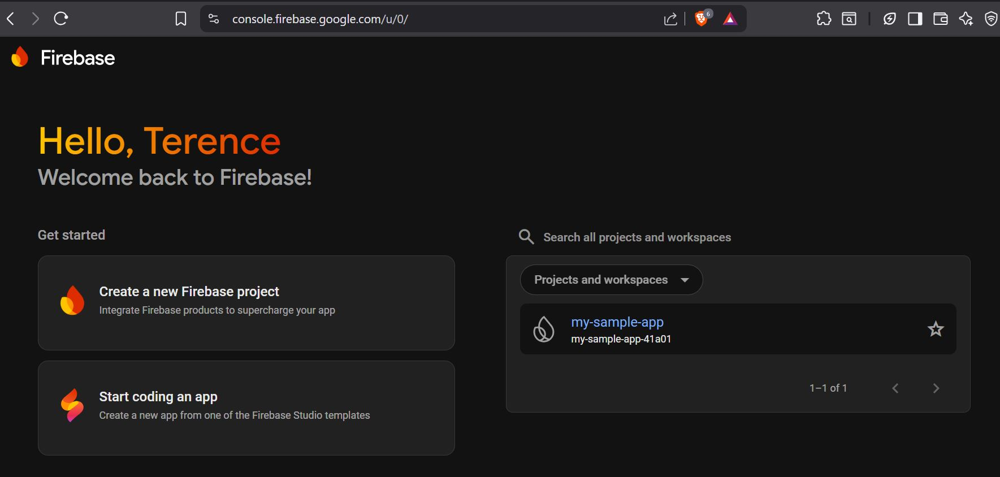
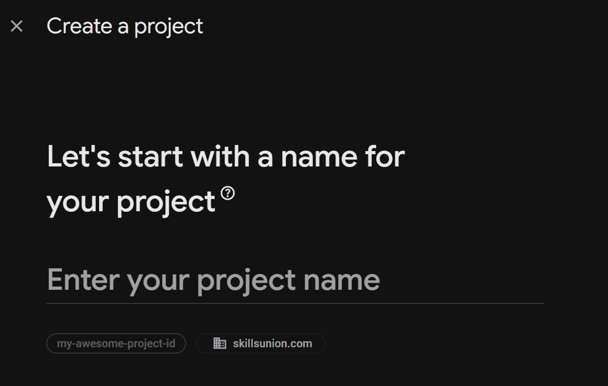
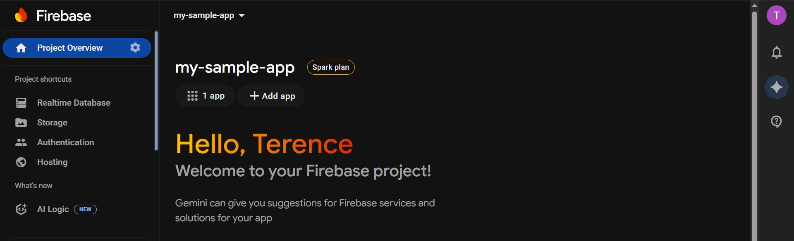
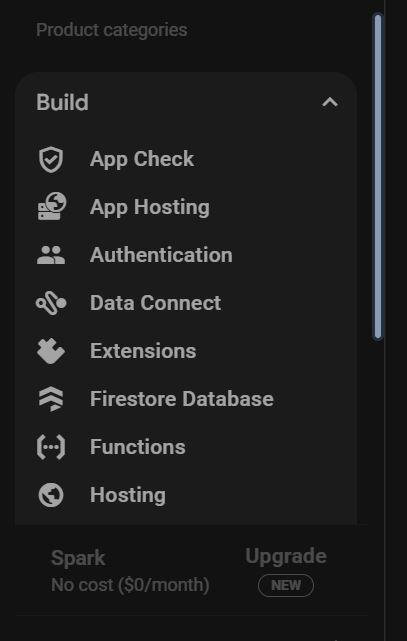

# Firebase Realtime Database

## Learning Objectives

1. Know what is Firebase is and what features does it have
2. Setup a Firebase Project and try some features
2. Know what is Firebase Realtime Database and what it is used for
3. Set up Firebase Realtime Database with React Apps powered by Vitejs

### Introduction

[Firebase](https://firebase.google.com/) is a platform by Google and a collection of tools for building, improving, and growing web and mobile applications, also known as a Backend-as-a-Service (BaaS). It allows developers to focus on frontend development and user experience by managing backend services like databases, secure user authentication, cloud storage, and hosting.

### Setting up a Firebase Project

Go to Firebase's [console](https://console.firebase.google.com/u/0/) or Go to the homepage (making sure that you're logged in to your Google account) and click on the "Go to console" on the upper right side of the homepage.

The console would allow developers to create a new project by inputting the necessary information and domain.

After creating the project, the console will show the app and developers can explore the different features using the Build option on the left-hand side.

### Firebase Realtime Database


Firebase Realtime Database is a convenient tool to develop app prototypes. Source: Firebase

<a href="https://firebase.google.com/docs/database" target="_blank">Firebase Realtime Database</a> is a "NoSQL" (i.e. non-relational) JSON database that allows us to persist app data with API calls and sync that data in real-time across multiple app instances (e.g. multiple users). Realtime Database is Firebase's first product and one of their most popular.

Start by reading the following official Firebase Realtime Database tutorials linked below.

### Structure your Database

Read the following Firebase <a href="https://firebase.google.com/docs/database/web/structure-data" target="_blank">official tutorial</a> on how to structure data in Realtime Database.

1. We can think of JSON objects as JavaScript objects
2. We will learn SQL when we learn about backend
3. We will follow the structure of data in this example to build chat functionality in this module's exercises

### Read and Write Data on the web

Read the following tutorial on <a href="https://firebase.google.com/docs/database/web/read-and-write" target="_blank">how to read and write data</a> to Firebase Realtime Database. Try to understand the code in each example. We will understand it in more detail when we work on this module's exercises.

1. Skip the "(Optional) Prototype and test with Firebase Local Emulator Suite" section. We can use this later when we need it.
2. We will be using the functions mentioned in the docs to write, read, update and delete data.
3. We may use `off()` to detach listeners when our React components unmount; no need to pay too much attention to this for now.
4. We can ignore "Save data as transactions" section for now. We can revisit this when we need this functionality.

### Work with Lists of Data

Read the following tutorial on <a href="https://firebase.google.com/docs/database/web/lists-of-data" target="_blank">how to read to, write to, sort and filter lists</a> in Realtime Database.

1. We will use functionality from both "Reading and writing lists" section and "Sorting and filtering data" section in our apps.

### Sample Implementation Legacy (Class Based)


What is Firebase


Firebase Realtime Database


Firebase Realtime Database Setting Data


Firebase Realtime Database Using Data

Please checkout the finished code in this <a href="https://github.com/skillsUnion/firebase-examples/tree/realtimedatabase" target="_blank">repository</a>, ensure that you're on the `realtimedatabase` branch. 

If you want to test out the application on your machine you will need to have registered an Application on Firebase with Realtime Database activated. 

To get the Firebase Credentials needed for our app to run, go to Project Settings -> Your app (adding an app if you haven't using the "Add App" and choose Web App) -> and check "npm" in the SDK setup and configuration option. You will get details such as the apiKey, authDomain, databaseURL, etc. 

You can use the `sample.env` within the application to create an `.env` file with your Firebase credentials and call them in the `firebase.jsx` file. With this in mind if you want to run the application on your machine you will need to install the dependencies with the command `npm install` after the installation you can then run the application with the command `npm run dev`. Then open a browser of your choice and navigate to  http://localhost:5173.
