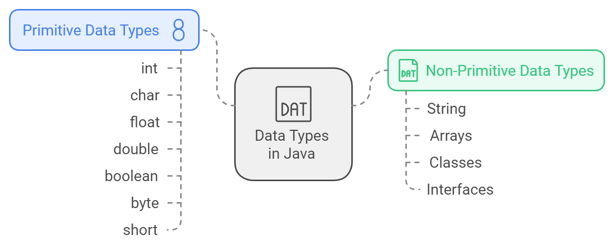

# Variables & Data Types

## Lesson Objectives

Understand and correctly use different data types in Java, including  int, float, char, boolean

Declare, initialize, and manipulate variables in a Java program.

Understand the concept of type casting (implicit and explicit) in Java.

## Variables

A variable in Java is a container that holds data values during the execution of a program. It acts as a named storage location in memory where a value can be assigned, retrieved, and modified. Each variable has a specific data type, which determines the kind of data it can store (e.g., int for integers, double for decimals, String for text).

```java
public class VariableExample {
    public static void main(String[] args) {
        // Declaring and initializing a variable
        int age = 25;    // 'age' is a variable of type int
        
        // Printing the value of the variable
        System.out.println("Age: " + age);
        
        // Modifying the value of the variable
        age = 30;
        System.out.println("Updated Age: " + age);
    }
}
```

## Data Types
In Java, variables must belong to a data type.




There are 8 primitive data types in Java:

| Whole Number | Decimal | Single Char | Boolean |
| :----------: | :-----: | :---------: | :-----: |
|     byte     |  float  |    char     | boolean |
|    short     | double  |
|     int      |         |
|     long     |         |


##  Create `LearnDataTypes.java`

#### Insert the following code

```java
public class LearnDataTypes {
    public static void main(String args[]){
        int num1 = 10;
        // The String needs to be converted into an Integer
        int num2 = Integer.parseInt(args[0]);
        System.out.println(num1 + num2);
    }
}
```
 Try replacing `Integer.parseInt(args[0])` with just `args[0]`. What happens and why?

You cannot perform `11 + "1"`. This expression adds a `String` value of `1` to `int` value of `11`, which would not work. Therefore, we had to perform `Integer.parseInt()` to parse a `String` to an `Integer`.

## Casting

Casting is the process of converting a value from one data type to another.

Casting can be done **explicitly** or **implicitly**.

**Explicit casting** is done by the developer using the `()` operator.

```java
int a = 10;
double b = 1.5;
int result = a + (int) b;
```

**Implicit casting** is done automatically by the compiler.

```java
int a = 10;
double b = 1.5;
double result = a + b;
```

This is possible because the converted value (`int`) fits within the range of the new data type (`double`).

In Java, there are two types of casting:

- **Widening Casting** (automatically) - converting a smaller type to a larger type size.
- **Narrowing Casting** (manually) - converting a larger type to a smaller size type.

```java
// Widening Casting
int myInt = 9;
double myDouble = myInt; // Automatic casting: int to double

System.out.println(myInt);      // Outputs 9
System.out.println(myDouble);   // Outputs 9.0

// Narrowing Casting
double myDouble = 9.78;
int myInt = (int) myDouble; // Manual casting: double to int

System.out.println(myDouble);   // Outputs 9.78
System.out.println(myInt);      // Outputs 9
```

### Converting from `String` to `Integer`

The earlier way of using `Integer.parseInt()` is for converting a `String` to an `Integer`. It uses the `parseInt()` method from the `Integer` class. This is not the same as casting, which uses the `()` operator.

### Numeric Literal Character Suffixes

Numeric literal character suffixes are used to indicate the type of the numeric literal.

```java
// L suffix for long
long longNum = 10000000000L;

// F suffix for float
float floatNum = 1.5F;

// D suffix for double
double doubleNum = 1.5D;
```

Why do we need to specify the type of the numeric literal?

- Without the suffix, the compiler will generally treat a whole number as an `int`, and a decimal number as a `double`.

```java
// Compiler treats 1.5 as a double
float f = 1.5; // Error: incompatible types: possible lossy conversion from double to float

// For double, the suffix is optional
double d = 1.5; // No error