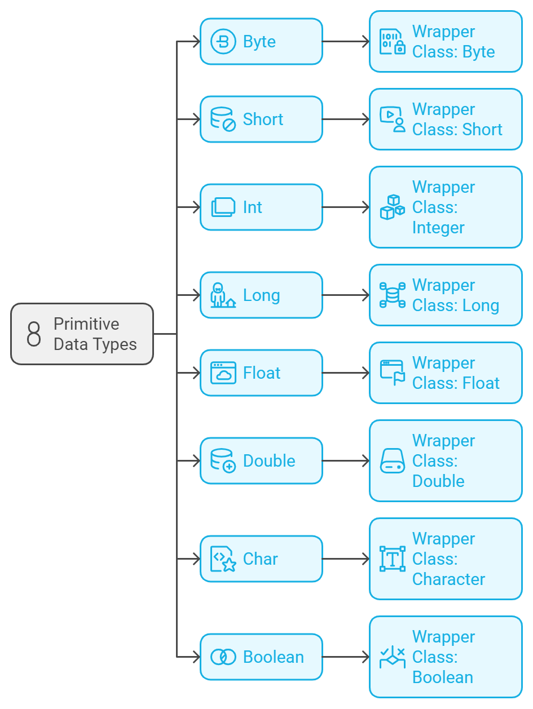

##  Wrapper Classes, Boxing and Unboxing

## Lesson Objectives

- Define and explain wrapper classes in Java and their importance in converting primitive data types into objects.

- Understand the concept of boxing (converting a primitive type to its corresponding wrapper class object).

- Understand the concept of unboxing (converting a wrapper class object back to its corresponding primitive type).

### Wrapper Classes

Recall Java has 8 primitive data types. For each of those types, there is a corresponding wrapper class (classes will be covered in more detail in a later lesson).



Wrapper classes provide a way to use primitive data types as objects, as well as provide some simple operations, which cannot be stored on a primitive.

For example, as you saw earlier, the `Integer` class provide a useful method to convert a `String` to an `Integer`.

```java
int num = Integer.parseInt("10");
```

You can also check the maximum and minimum values of an `Integer`.

```java
System.out.println(Integer.MAX_VALUE);
System.out.println(Integer.MIN_VALUE);
```

We can declare an `Integer` object like this instead using the primitive data type:

```java
Integer num = 10;
```

But as a rule of thumb, it is better to use the primitive data type unless you need to use the wrapper class methods.

### Boxing and Unboxing

Boxing is the process of converting a primitive data type to its corresponding wrapper class.

Java does autoboxing, which is the automatic conversion of a primitive data type to its corresponding wrapper class.

```java
Integer boxedNum = 10;
```

Unboxing is the process of converting a wrapper class to its corresponding primitive data type.

Java does auto-unboxing, which is the automatic conversion of a wrapper class to its corresponding primitive data type.

```java
int unboxedNum = boxedNum;
```