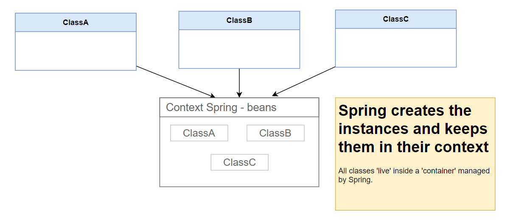

# Inversion of Control (IoC) and Dependency Injection (DI) in Spring Boot

## Lesson Objectives

- Understand the concept of Inversion of Control (IoC) and how it helps in decoupling components in a Spring Boot application.

-  Learn the basics of Dependency Injection (DI) in Spring Boot with a simple coding example.

---

## What is Inversion of Control (IoC)?

Inversion of Control is a design principle in which the control of object creation and dependency management is transferred from the application code to the Spring Framework. This helps in decoupling components and makes the code more modular and easier to test.

### Real-World Analogy:

Imagine you're assembling a car. Instead of manually assembling all the parts (engine, wheels, etc.), a factory provides you a fully assembled car. Similarly, in IoC, Spring takes care of creating and managing objects for you.

---

## What is Dependency Injection (DI)?

Dependency Injection is a design pattern used to implement IoC. It allows Spring to inject dependencies (objects or components) into a class instead of the class instantiating them directly.

### Types of DI:

1. **Constructor Injection**
2. **Setter Injection**
3. **Field Injection**

---

## Beans and Dependency Injection

In the entry point of every Spring Boot application i.e. our `main` method, you will see the `@SpringBootApplication` annotation. This annotation is a combination of 3 annotations:

- `@Configuration` - Indicates that the class contains `@Bean` annotations, pick them up and add them into the spring container.

- `@ComponentScan` - To scan for all `@Component` annotations classes located in the same package (or explicitly specified) and add them to the spring container.

- `@EnableAutoConfiguration` - Looks for auto-configuration bean (java class) and add them into the spring container.

Therefore, `@SpringBootApplication` annotation is a Spring Boot feature to quickly boostrap the default/commonly used annotations into one.

Classes that are annotated with `@Component` are known as **Spring Beans**. Spring Beans are managed by the Spring IoC container, also known as the Spring Context or Application Context. The Spring IoC container is responsible for instantiating, configuring, and assembling the Spring Beans.



>  <a href ="https://gustavopeiretti.com/spring-injection-dependencies/" target ="_blank">Image Source </a>

`@Autowired` is used to inject the dependencies into the class. There are multiple ways to inject dependencies into a class.


| Type        | Description                                                 | Remarks                                              |
| ----------- | ----------------------------------------------------------- | ---------------------------------------------------- |
| Constructor | Dependencies are injected through the constructor.          | Preferred method of dependency injection.            |
| Setter      | Dependencies are injected through setter methods.           | Useful when you want to change the dependency later. |
| Field       | Dependencies are injected directly into the class property. | Not recommended.         


## Coding Example: Understanding IoC and DI in Spring Boot

Let's create a simple Spring Boot application `di-demo` to see how all these works. Add the Spring Web and Spring Boot devtools dependencies in `pom.xml`:

```xml
<dependency>
  <groupId>org.springframework.boot</groupId>
  <artifactId>spring-boot-starter-web</artifactId>
</dependency>
<dependency>
  <groupId>org.springframework.boot</groupId>
  <artifactId>spring-boot-devtools</artifactId>
  <scope>runtime</scope>
</dependency>
</dependencies>
```

Let's create `MathTeacher.java` and `ScienceTeacher.java` classes:

`MathTeacher.java`

```java
public class MathTeacher  {
  public String teach() {
    return "Teaching Math";
  }
}
```

`ScienceTeacher.java`

```java
public class ScienceTeacher  {
  public String teach() {
    return "Teaching Science";
  }
}
```

Create `TeacherController.java`:

```java
@RestController
public class TeacherController {
  private MathTeacher mathTeacher = new MathTeacher();
  private ScienceTeacher scienceTeacher = new ScienceTeacher();

  @GetMapping("/math-teacher")
  public String mathTeacher() {
    return mathTeacher.teach();
  }

  @GetMapping("/science-teacher")
  public String scienceTeacher() {
    return scienceTeacher.teach();
  }
}
```

Test out the endpoints.

Currently we are creating the instances ourselves. Let's use dependency injection instead.

In order to use dependency injection, we need to let Spring Boot know that `MathTeacher` and `ScienceTeacher` are Spring Beans. Remember that beans are just classes that are managed by Spring. We can do this by annotating them with `@Component`. After you do this, you can see these beans in your Spring Boot Dashboard.

Let's use field injection for the science teacher by adding the `Autowired` annotation to the `scienceTeacher` field:

```java
// private ScienceTeacher scienceTeacher = new ScienceTeacher();
@Autowired
private ScienceTeacher scienceTeacher;
```

Notice now that without having to instantiate the `ScienceTeacher` class, we can still use the `scienceTeacher` bean.

Now, field injection is not ideal because it makes it difficult to test the class (testing is covered in a later lesson). Let's use constructor injection instead:

```java
// @Autowired
private ScienceTeacher scienceTeacher;

@Autowired
public TeacherController(ScienceTeacher scienceTeacher) {
  this.scienceTeacher = scienceTeacher;
}
```

Test it out to make sure it still works.

Behind the scenes, what Spring is doing is this:

```java
// Create a new instance of ScienceTeacher
ScienceTeacher scienceTeacher = new ScienceTeacher();
// Inject the instance into the constructor
TeacherController teacherController = new TeacherController(scienceTeacher);
```

Now, let's see how setter injection works on the MathTeacher bean:

```java
private MathTeacher mathTeacher;

@Autowired
public void setMathTeacher(MathTeacher mathTeacher) {
  this.mathTeacher = mathTeacher;
}
```

Then call the `/math-teacher` endpoint to test it out.

Behind the scenes, Spring is doing this:

```java
// Create a new instance of MathTeacher
MathTeacher mathTeacher = new MathTeacher();
// Inject the instance into the setter
teacherController.setMathTeacher(mathTeacher);
```


## Key Takeaways:

1. IoC shifts the responsibility of creating and managing objects from your application to the Spring Framework.

2. Dependency Injection allows Spring to inject required dependencies into your classes, promoting loose coupling and easier testing.


---
#### Further Reading
- <a href="https://docs.spring.io/spring-framework/docs/current/reference/html/core.html#spring-core" target="_blank"> Spring IoC Documentation </a> 

- <a href="https://spring.io/projects/spring-boot" target="_blank"> Spring Boot Overview </a>

---

