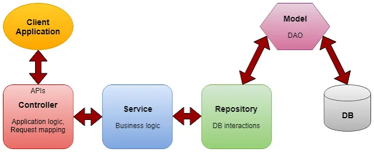

## Service and Repository Pattern

## Lesson Objectives:

- Learn the importance of separating concerns in a Java application by understanding the purpose of the Controller, Service, and Repository layers.
   
- Understand the concept of "thin controllers/repositories and fat services" to simplify maintenance and testing.

- Learn how to refactor code by moving business logic to the service layer and CRUD operations to the repository layer in the `simple-crm` application.

#### Lets look back to our `simple-crm` application.

So far, all of our code is in the controller layer. This is not ideal because we are mixing our business logic with our controller logic. This makes our code difficult to maintain and test.

As you might have noticed, our `CustomerController` class is doing more than one thing. It is managing the HTTP requests, handling some business logic, as well as performing CRUD operations on our `ArrayList`.

##### We should ideally seperate our code into s Controller, Service and Repository layers. Learn more by watching the following video:

<iframe width="560" height="315" src="https://www.youtube.com/embed/mS1L96GqwSU?si=brZj2E8jIFJ4Gm0q" title="YouTube video player" frameborder="0" allow="accelerometer; autoplay; clipboard-write; encrypted-media; gyroscope; picture-in-picture; web-share" referrerpolicy="strict-origin-when-cross-origin" allowfullscreen></iframe>

### Service and Repository

The Service and Repository pattern is a common design pattern used in Java applications.

<a href= "http://randikatech.blogspot.com/2019/09/get-your-hands-dirty-with-micro-services.html" target ="_blank"> Image Source </a>

Instead of putting all our code in the controller layer, we can separate our code into 3 different layers:

| Layer      | Purpose                             |
| ---------- | ----------------------------------- |
| Controller | Handles HTTP requests and responses |
| Service    | Handles business logic              |
| Repository | Handles CRUD operations             |

The controller should only handle HTTP requests and responses. The repository should only handle CRUD operations. The service should handle all the business logic e.g. validation, data manipulation, etc.

Hence, it is often suggested to have **thin controllers/repositories and fat services**. This helps to keep the controllers and repositories simple and easy to maintain. More importantly, it centralizes all the business logic in the service layer.

This can help to achieve the goal of creating an architecture that supports easy maintenance, testing, and scalability, while keeping your codebase organized and readable.

---