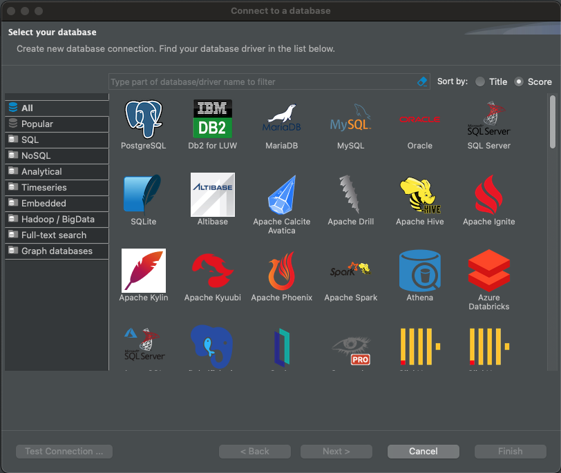
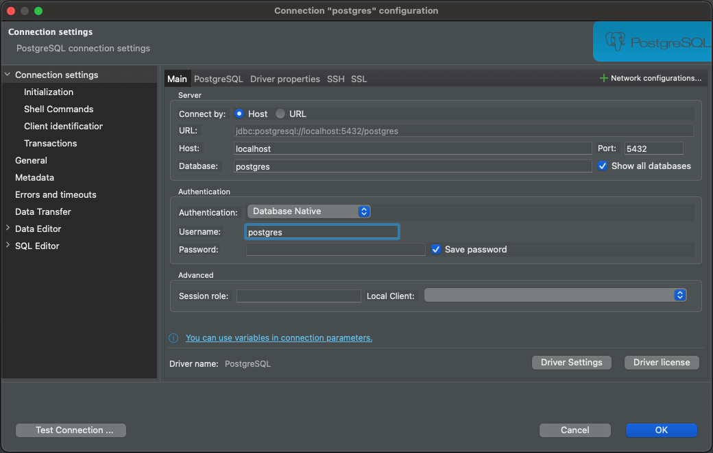

## Installing PostgreSQL and DBeaver


## Lesson Objectives

- Understand how to install PostgreSQL on Windows and Mac systems.
- Learn how to set up and configure DBeaver as a database management tool.
- Successfully connect DBeaver to a PostgreSQL database and explore its features.

---
#### This lesson provides step-by-step instructions to install **PostgreSQL** on Windows and Mac, and how to install **DBeaver** and connect it to PostgreSQL.

#### **1. Installing PostgreSQL**

#### PostgreSQL

PostgreSQL is a relational database management system (RDBMS). It is open source and free. It is also known as Postgres and it is popular for its reliability, robustness, and performance.

Check if you have PostgreSQL installed:

```sh
psql --version
```

##### **On Windows:**

1. **Download the Installer:**
   - Go to the <a href="https://www.postgresql.org/download/" target="_blank"> PostgreSQL Downloads page </a>
   - Select **Windows** and click on the download link.
   - **Recommended Version:** Download the latest stable version (e.g., PostgreSQL 15 or newer) as it includes all the latest features and updates. Ensure you download the version compatible with your system (most likely **64-bit**).

2. **Run the Installer:**
   - Open the downloaded file and run the installer.
   - Follow the setup wizard and choose the default options:
     - Install PostgreSQL Server and pgAdmin.
     - Set a password for the superuser (e.g., `postgres`).

3. **Complete the Installation:**
   - Use the default port (`5432`) unless you need a custom setup.
   - Launch pgAdmin to verify the installation.

##### **On Mac:**

1. **Install Homebrew (if not already installed):**
   - **Only follow this step if Homebrew is not already installed on your system.**
   - Open the Terminal and install Homebrew using the following command:
     ```bash
     /bin/bash -c "$(curl -fsSL https://raw.githubusercontent.com/Homebrew/install/HEAD/install.sh)"
     ```
   - Follow the on-screen instructions to complete the installation.

2. **Install PostgreSQL Using Homebrew:**
   - After Homebrew is installed, run the following commands:
     ```bash
     brew update
     brew install postgresql
     brew services start postgresql
     ```
   - **Recommended Version:** Homebrew installs the latest stable version automatically.

3. **Verify Installation:**
   - Open the PostgreSQL command-line interface:
     ```bash
     psql postgres
     ```

4. **Alternative Installer:**
   - If not using Homebrew, download the macOS installer from <a href="https://www.postgresql.org/download/" target= "_blank"> PostgreSQL Downloads</a>  and follow the setup wizard (similar to Windows).
   - **Recommended Version:** Choose the latest stable version (e.g., PostgreSQL 15 or newer).

---
##### **On Other Operating Systems:**

1. **Linux (Debian/Ubuntu):**
   - Open the Terminal and run the following commands:
     ```bash
     sudo apt update
     sudo apt install postgresql postgresql-contrib
     ```
   - Verify the installation:
     ```bash
     psql postgres
     ```

2. **Linux (Red Hat/CentOS):**
   - Open the Terminal and run the following commands:
     ```bash
     sudo yum install -y postgresql-server postgresql-contrib
     sudo postgresql-setup initdb
     sudo systemctl start postgresql
     sudo systemctl enable postgresql
     ```


### **Installing DBeaver**

1. **Download DBeaver:**
   - Visit the <a href="https://dbeaver.io/" target = "_blank">DBeaver website </a>
   - Download the **Community Edition** for your operating system (Windows or macOS).

2. **Install DBeaver:**
   - Run the downloaded installer and follow the instructions to complete the setup.

3. **Launch DBeaver:**
   - Open DBeaver after installation.

---

#### **3. Connecting DBeaver to PostgreSQL**

1. **Create a New Database Connection:**

      

   - Open DBeaver and click on **"New Database Connection"** or the `+` icon in the toolbar.
   - Select **PostgreSQL** from the list of database types.

2. **Enter Connection Details:**

     

   - Fill in the following information:
     - **Host:** `localhost`
     - **Port:** `5432` (default PostgreSQL port)
     - **Database:** `postgres` (or the name of your database)

   - **For Windows:**
     - **Username:** `postgres`
     - **Password:** The password you set during PostgreSQL installation.

   - **For Mac:**
     - **Username:** Your macOS username (by default).
     - **Password:** No password is required for local connections unless you configured one.

   - **For Linux:**
     - **Username:** `postgres` (default superuser account).
     - **Password:** No password is required for local connections unless you configured one during setup.

3. **Test the Connection:**
   - Click on **"Test Connection"** to ensure the details are correct.
   - If successful, click **"Finish"** to save the connection.

4. **Explore Your Database:**
   - You can now browse schemas, run SQL queries, and manage your PostgreSQL database using DBeaver.


---

### Adding a New Database

With PostgreSQL installed, we can now create a new database for our application.

This can be done using DBeaver or using psql shell.

```sql
CREATE DATABASE simple_crm;
```

In DBeaver, right click on "Databases" and select "Create Database". Enter the database name and click "OK".

---

### **Summary**
- PostgreSQL is installed on Windows, Mac, or Linux using the appropriate installer or package manager.
- **Recommended Version:** Always download the latest stable version (e.g., PostgreSQL 15 or newer).
- DBeaver is installed and configured as a database management tool.
- Connecting DBeaver to PostgreSQL involves providing the host, port, database name, username, and password.

For any issues, feel free to revisit the steps or consult the official documentation for <a href ="https://www.postgresql.org/docs/" target="_blank">PostgreSQL </a> and <a href= "https://dbeaver.io/" target="_blank"> DBeaver</a>.

