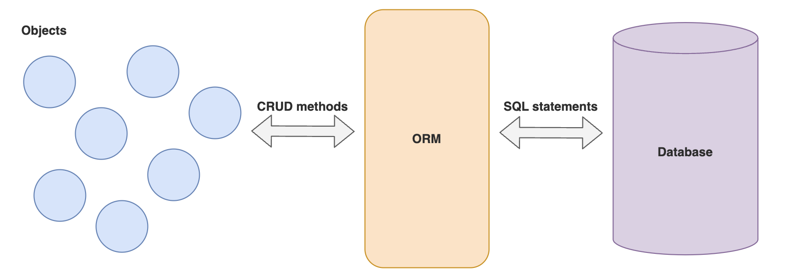

## Introduction to JPA and Hibernate with ORM Basics

## Lesson Objectives:

- Understand the basics of JPA and its role in managing data between Java objects and relational databases.

- Learn the concept of Object Relational Mapping (ORM) and its benefits for database operations.  

- Explore Hibernate as an implementation of the JPA specification and its default integration with Spring Boot.  

### JPA 

JPA now stands for **Jakarta Persistence API**, previously known as **Java Persistence API**. The name change was due to Oracle transferring Java EE to the Eclipse Foundation and since Oracle owns the trademark for Java, the name had to be changed. If you're interested you can read up further <a href="https://www.baeldung.com/java-enterprise-evolution" target="_blank"> here </a>.

JPA is a specification for accessing, persisting, and managing data between Java objects and a relational database.

### Object Relational Mapping (ORM)

ORM is a programming technique for mapping objects to relational databases. It is a way to store and retrieve data from a database using object-oriented programming languages.

This is useful because it allows us to use the same object-oriented code to interact with different databases, instead of having to write code specific to each database.

The syntax of different databases can vary greatly, so using an ORM allows us to write code that is independent of the database we are using. e.g. the syntax for creating a table in MySQL is different from the syntax for creating a table in PostgreSQL.

### Hibernate

Note that JPA is only a specification i.e. it is not an implementation.

Hibernate is an implementation of the JPA specification. It is an ORM tool that provides a framework for mapping an object-oriented domain model to a relational database.

By default, Spring Boot uses Hibernate as its JPA implementation. Hence, we may sometimes use the terms JPA and Hibernate interchangeably.

---