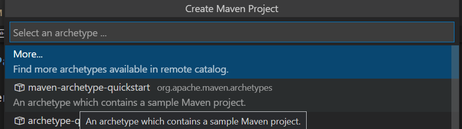
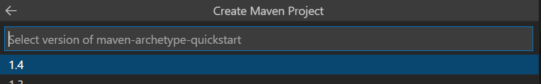
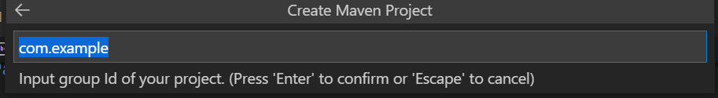
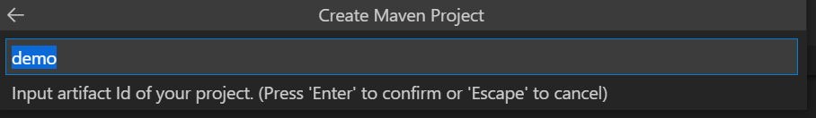
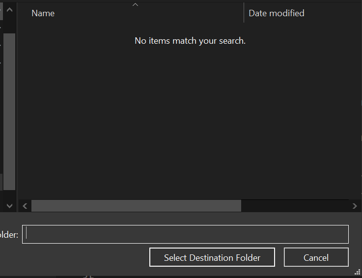
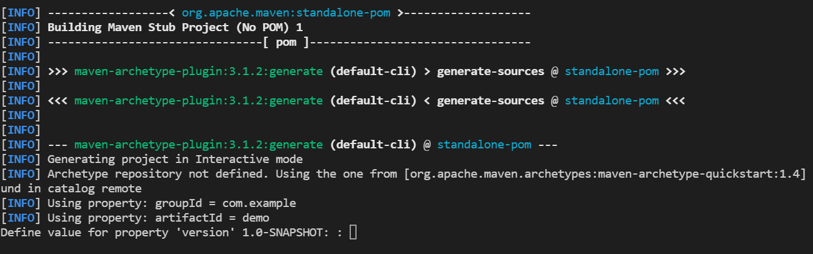
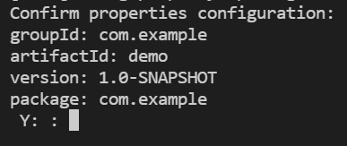
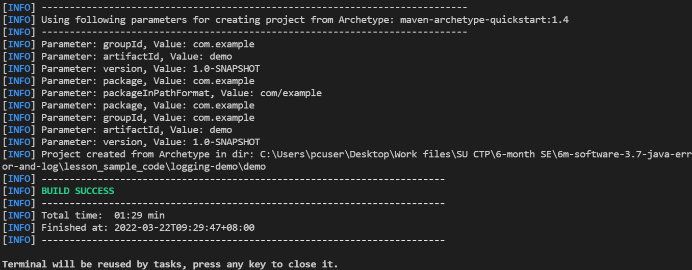
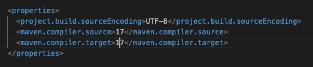

## Installing Maven

## Lesson Objective :

1. Installing Maven on Windows and Mac.
2. Setting up the Maven extension in VS Code.
3. Building and running a Maven project in VS Code.
---


---
Maven is a build automation tool used primarily for Java projects. It is used to manage dependencies and automate the build process such as compiling source code, packaging the compiled code into a JAR file, as well as running automated tests. 
---

### Step 1: Installing Maven on Windows

#### 1.1 Download Maven
1. Go to the <a href="https://maven.apache.org/download.cgi" target="_blank"> Maven Download Page </a>
2. Under "Files", click on the link to download the binary zip file (e.g., `apache-maven-3.x.x-bin.zip`).

#### 1.2 Install Maven
1. Extract the ZIP file to a directory (e.g., `C:\Program Files\Maven`).
2. Set the `MAVEN_HOME` environment variable:
   - Right-click on **This PC** or **Computer** > **Properties** > **Advanced system settings** > **Environment Variables**.
   - Click **New** under System Variables, and set:
     - **Variable Name**: `MAVEN_HOME`
     - **Variable Value**: the directory where you extracted Maven (e.g., `C:\Program Files\Maven\apache-maven-3.x.x`).
3. Update the `Path` environment variable:
   - In the **System variables** section, find and select the `Path` variable, then click **Edit**.
   - Add the Maven `bin` directory path (e.g., `C:\Program Files\Maven\apache-maven-3.x.x\bin`).
4. Open a new command prompt and run:
   ```
   mvn -v
   ```
   You should see Maven’s version information if the installation was successful.

---

### Step 2: Installing Maven on Mac

#### 2.1 Install Maven Using Homebrew
If you have Homebrew installed, the easiest way to install Maven is by running:
```bash
brew install maven
```

#### 2.2 Manual Installation (if Homebrew is not available)
1. Download Maven from the <a href="https://maven.apache.org/download.cgi" target="_blank"> Maven Download Page
</a>
2. Extract the ZIP file to a directory (e.g., `/usr/local/apache-maven`).
3. Set the `MAVEN_HOME` environment variable:
   Add the following to your `~/.bash_profile` or `~/.zshrc` file:
   ```bash
   export MAVEN_HOME=/usr/local/apache-maven/apache-maven-3.x.x
   export PATH=$MAVEN_HOME/bin:$PATH
   ```
4. Reload your profile:
   ```bash
   source ~/.bash_profile  # or source ~/.zshrc
   ```
5. Run:
   ```bash
   mvn -v
   ```
   This should display Maven’s version information.

---
## Building Maven project on VSCode

Check your VSCode extensions to see if Maven for Java is installed. This should already have been installed with the Java Extension Pack.

### Creating a Maven Project

We can create a Maven project using <a href =  "https://maven.apache.org/guides/getting-started/maven-in-five-minutes.html" target="_blank">CLI </a> or using VSCode.

In the Primary Side Bar, under the Maven or Java Projects tab, click on the plus sign to create a new Maven project.

##### Select the `maven-archetype-quickstart` archetype and click Next:



##### Select the version of Maven to use. Click Next.



##### Enter the group ID (`package` path), usually in reverse domain name notation e.g. sg.edu.ntu



##### Enter the artifact ID (project name).
 


##### Choose a folder to place the project in.
 


##### Hit 'enter' to use the default version value.
 


##### The project properties will be listed for confirmation. Type 'Y' to confirm.
 


##### The project is now created in the folder you chose.



##### Open the project in a new VSCode window.

##### Open the `pom.xml` file and update the compiler settings to 17



#### 3. **Running Maven Commands from VS Code**

   - **Step 1**: Open the terminal in VS Code (`Ctrl+``).
   - **Step 2**: Run `mvn clean install` to build the project.

   
---


---


