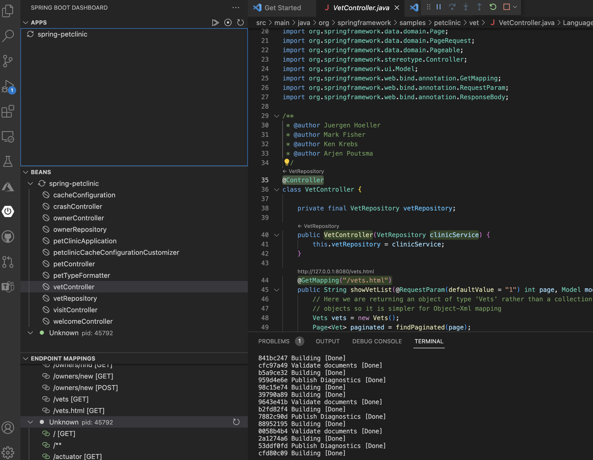

## Getting Started with Spring Boot

## Lesson Objectives

- Understand the Fundamentals of Spring Boot

- Differentiate Between Opinionated and Non-Opinionated Frameworks

- Set Up and Run a Basic Spring Boot Application

- Learn to create a Spring Boot project using Spring Initializr and run it via the Spring Boot Dashboard in VS Code.

##  What is Spring Boot

Java Spring Boot is a framework that allows us to build web applications quickly and easily. It is built on top of the Spring framework and provides a simpler and faster way to set up, configure, and startup web-based applications.

### Opinionated vs Non-opinionated Framework

Java Spring Boot is an **opinionated** framework. This means that it provides a set of predefined conventions, best practices, and structures that developers are expected to follow. This allows us to focus on building the application and reduces the number of decisions to make.

This is in contrast to a **unopinionated** library such as React, where we have to make a lot of decisions on how to structure the application. Developers have to decide on the folder structure, the libraries to use, etc. It does not enforce any conventions or best practices. As a result , the codebases of non-opinionated libraries tend to be more diverse and inconsistent.

### Inversion of Control (IoC) and Dependency Injection (DI)

Spring Boot uses the **Inversion of Control (IoC)** principle to manage the dependencies of the application. Inversion of Control means that the control of the application is inverted.

In traditional programming, our code directly controls the creation and management of objects. e.g. :

```java
public class MyApplication {
  public static void main(String[] args) {
    // Create a new object
    MyObject myObject = new MyObject();
    // Call a method on the object
    myObject.doSomething();
  }
}
```

With IoC, instead of the application controlling the objects, the objects are controlled by the framework.

Spring Boot achieves this by using Dependency Injection (DI). This is done by injecting the dependencies i.e., the objects that a class depends on, into the class. This is in contrast to the class creating the dependencies itself as in the example above.

##### We will study IoC and DI in details in subsequent lessons.

### Creation of Spring Project via Initializr

Note: We will be using Spring Boot 3.3.5

First, click here <a href="https://marketplace.visualstudio.com/items?itemName=vmware.vscode-boot-dev-pack" target="_blank">to install the Spring Boot Extension Pack</a>.in VS Code. Restart VS Code after installation.

We can create a new Spring Boot Project using Spring Initializr. This can be done using the Spring Boot Extension Pack or by going to <a href="https://start.spring.io/" target="_blank">Spring Initializr</a>.


1. Open your Command Palette (Ctrl/Cmd + Shift + P) and type in "Spring Initializr" and select "Create a Maven Project".
1. Choose version `3.3.5`.
1. Choose Java as language.
1. The `groupId` identifies your organization. Usually we use the reverse domain name of your organization e.g., com.example)
1. The `artifactId` is the name of your application. The convention is use lowercase and hyphenate multiple words e.g. `spring-demo`.
1. For packaging type, choose `jar`.
1. For Java version, choose `17`.

We do not need any dependencies for now.

Select the folder to save the project, and open the project in VS Code.

### Structure of a Spring Boot Project

A Spring Boot project is a Maven project. Maven is a build automation tool used primarily for Java projects. It is used to manage the dependencies of the project and to build the project.

The structure of a Spring Boot project is as follows:

```
spring-demo
├── src
│   ├── main
│   │   ├── java
│   │   │   └── com
│   │   │       └── example
│   │   │           └── myspringbootproject
│   │   │               └── MySpringbootProjectApplication.java
│   │   └── resources
│   │       └── application.properties
│   └── test
│       └── java
│           └── com
│               └── example
│                   └── myspringbootproject
│                       └── MySpringbootProjectApplicationTests.java
├── target
├── mvnw
├── mvnw.cmd
├── pom.xml
└── README.md
```

- `src` : source code of the application.
- `main` : functional code of the application.
- `test` : test code.
- `target` : compiled code. This folder is created when we compile the code.
- `resources` : resources such as images, etc.
- `application.properties` file : configuration properties for the application.
- `pom.xml` file : the configuration for Maven.
- `mvnw` and `mvnw.cmd` files: Maven wrappers
- `README.md` file : documentation for the project.

### Running the Spring Boot Application

Every application has an entry point. For Spring Boot, the entry point is the `main` method in the `MySpringbootProjectApplication.java` file (or whatever name you have given to the project).

```
src/main/java/com/example/myspringbootproject/MySpringbootProjectApplication.java
```

Notice that the initial code is annotated with `@SpringBootApplication`. This instruments the class to be the entry point for the Spring Boot application.

```java
@SpringBootApplication
public class DemoSpringBootApplication {

	public static void main(String[] args) {
		SpringApplication.run(DemoSpringBootApplication.class, args);
	}

}
```

We can run the Spring Boot application using the `mvn` command in the terminal. If you look at the project folder, you will also see a `mvnw` file. This is a Maven wrapper that allows us to run Maven commands without having to install Maven on our computer. Both commands will work.

To run the Spring Boot app:

```bash
mvn spring-boot:run
```

You can also use the Maven wrapper:

```bash
# For Bash 
./mvnw spring-boot:run
# For PowerShell
.\mvnw spring-boot:run
# For Windows Command Prompt
mvnw spring-boot:run
```

This compiles the code and runs the application.

We can specify the `clean` option to clean the target folder before compiling the code. This is useful if you have made changes to the code and want to recompile the code from scratch. Sometimes, this fixes some random issues with running the application.

```bash
mvn clean spring-boot:run
```

#  Spring Boot Dashboard in VS Code

#### You can also manage your Springboot Applications using Spring Boot Dashboard.

 With Spring boot dashboard you can run/debug Applications: Easily start, stop, or restart multiple Spring Boot applications with one click.

Follow these steps to use the **Spring Boot Dashboard** in VS Code to run your Spring Boot application:

---

## Step 1: Install Required Extensions  
1. Open **VS Code**.  
  
2. Check that you already have the following extension:
   - **Spring Boot Extension Pack**  : This includes Spring Boot Dashboard.  
   -**Java Extension Pack** : This you must have already installed in the begining of java lessons.
    

---

## Step 2: Open Your Spring Boot Project  
1. Open your Spring Boot project folder in VS Code.  
2. Ensure the project has been set up correctly with a `pom.xml` (Maven) or `build.gradle` (Gradle) file.  

---

## Step 3: Access the Spring Boot Dashboard  
1. Click on the **Spring Boot Dashboard** icon in the Activity Bar on the left-hand side of VS Code (it looks like a Spring leaf).  

   
  
 
   
2. The dashboard will display all detected Spring Boot projects in your workspace.  

---

## Step 4: Run Your Spring Boot Application  
1. Hover over your Spring Boot project in the dashboard.  
2. Click the **Play (▶)** icon to start the application.  

     

3. VS Code's terminal will show the logs as the application starts.  

---

## Step 5: Interact with Your Application  
- After the application starts, you can access it in your browser (default: `http://localhost:8080`).  
- Use the dashboard to:  
  - **Stop** the application.  
  - **Restart** the application.  

---

## Step 6: Debug Your Spring Boot Application (Optional)  
1. Click the **Bug (Debug)** icon in the Spring Boot Dashboard.  
2. VS Code will launch the application in debug mode, allowing you to set breakpoints and debug the code.  

---

## Troubleshooting

### Common Issues:

- **Error: `JDK not found`**
  - Ensure your JDK is installed and the `JAVA_HOME` environment variable is set.
  - Ensure your JDK is installed and the `JAVA_HOME` environment variable is set.

- **Project Fails to Run**
  - Check the logs for errors and ensure all dependencies are correctly configured in the `pom.xml` or `build.gradle`.

- **Extensions Not Working**
  - Restart VS Code or reinstall the extensions.

  ---

## Embedded Video Guide for reference:

Here’s a video guide to help you set up a Spring Boot project in VS Code:

<iframe width="560" height="315" src="https://www.youtube.com/embed/oYEozZ4PtKw" title="YouTube video player" frameborder="0" allow="accelerometer; autoplay; clipboard-write; encrypted-media; gyroscope; picture-in-picture; web-share" referrerpolicy="strict-origin-when-cross-origin" allowfullscreen></iframe>

---

## Additional Resources

- <a href="https://spring.io/projects/spring-boot">Spring Boot Documentation</a>
- <a href="https://spring.io/guides">Spring Guides</a>
- <a href="https://docs.spring.io/initializr/docs/current/reference/html/">Spring Initializr Documentation</a>

---


