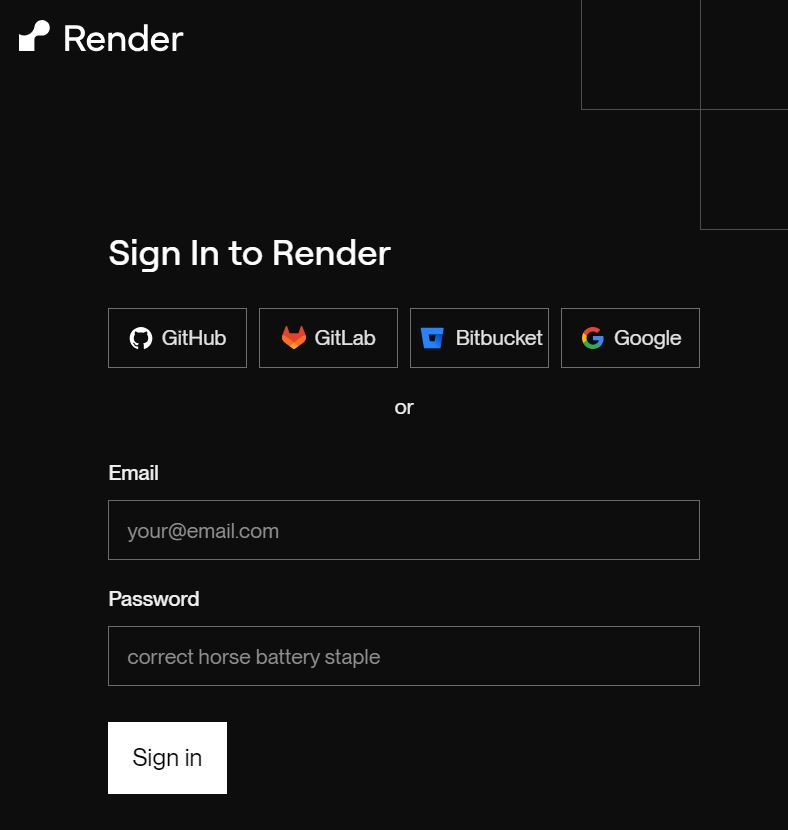
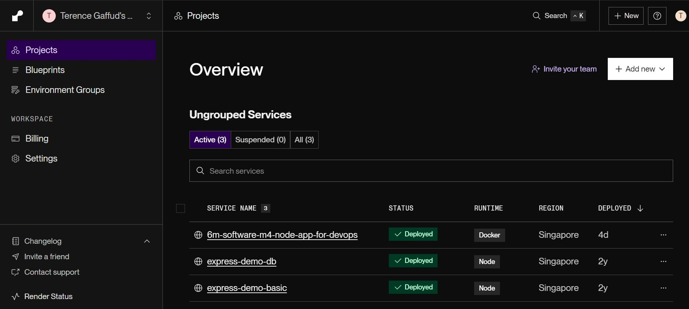
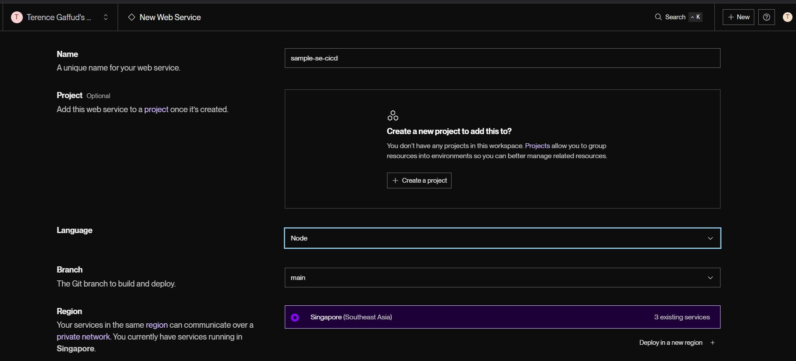
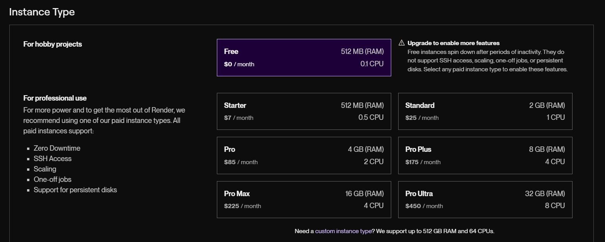
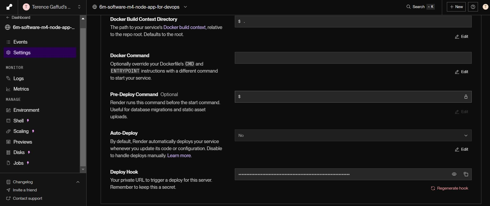
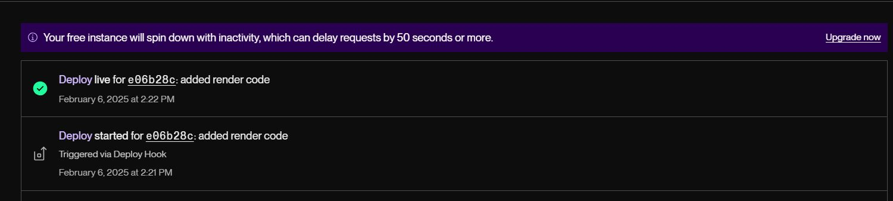

# Continuous Deployment

## Learning Objectives
1. Explain what Continuous Delivery is and what its benefits are
2. Configure CD workflow for tagged container release based on the Semantic Versioning convention
3. Implement the CD Pipeline that pull image from registry and deploy them to a container hosted environment.

## Continuous Deployment / Delivery

Continuous delivery is an extension of continuous integration since it automatically deploys all code changes to a testing and/or production environment after the build stage. It emphasizes automation, testing, and frequent reliable releases to enable rapid delivery of software updates.

### Principles of Continuous Delivery

In order for teams to implement Continuous Delivery, they must adhere to the following principles:
- Repeatable reliable process
- Automate everything
- Version control
- Build with quality
- Do the hardest parts first
- Everyone is responsible
- "Done" means released
- Continuous improvement
- Benefits of Continuous Delivery

Having Continuous Delivery for your products provide the following benefits:

- Automate the Software Release Process
- Improve Developer Productivity
- Find and Address Bugs Quicker
- Deliver Updates Faster

### Use Case of Continuous Deployment - Software A/B Testing
[Software A/B Testing](https://vwo.com/ab-testing/#what-is-a-b-testing), also known as split testing, compares two versions of an app or webpage to identify the better performer. It shows two or more versions of a variable (web page element, etc.) to different sets of users to determine which version leaves the maximum impact and drives business metrics.

Having Continuous Deployment allows teams to create and deploy multiple versions of a codebase by simply changing a variable and running it through the CICD pipeline. This closes the testing time gap and feedback based on the A/B testing can be applied for the next release cycle.

## CD Pipeline

### CD Pipeline jobs

The Continuous Delivery Pipeline typically contains the following jobs:

1. Detect there is a release
2. Pull respective image from container registry
3. Deploy the container to the respective environments

### Environments

Usually, there are three types of environments that developers use to determine which code they would release to:

- Staging - An environment to perform User Acceptance Test by stakeholders before deploying to production.
- Production - An environment where real users consumes the software (web app or mobile app).
- Disaster Recovery - In case of natural disaster such as earthquake or fire on the production physical servers, the Disaster Recovery environment will be activated to replace the production.

Note that depending on the software development team, you can create more environments to suit the needs of the project.

### Hosting options

There are multitudes of hosting options available for developer teams, some can be in-house and some use cloud infrastructure, these allows teams to host their applications and related services, such as databases. 

Do note that most if not all hosting sites would be paid in order for developers to use their services.

Here are some of the most popular hosting services that are available:
1. AWS EC2
2. Google Cloud Platform
3. Microsoft Azure
4. Heroku
5. Digital Ocean
6. Render

Some platforms offer hosting services for multiple programming languages and some would offer for a specific set of languages. So feel free to choose the service your team and project needs.

For this program, we will be using Render for demonstration purposes, but feel free to try out other hosting services.

## Render Setup

[Render](https://render.com/) is a fully-managed cloud platform where you can host static sites, backend APIs, databases, cron jobs, and all your other apps in one place.

### Render Account Setup

Go to Render's homepage and click on "Sign-in" and choose your Github or Google account to allow Render to link to your accounts. 



Follow the prompts that would appear to finish setup. After this, you will be directly to your workspace.



In the workspace, you can see all the services and projects that you have hosted. And you can create your own service using the "Add New" button.

### Hosting Demonstration 

For this part, we will attempt to host the [simple ExpressJS app](https://github.com/SkillsUnion/se-sample-cicd) that we have been working on in the previous lesson. We would be continuing where we left off in the previous lesson. Previously, we had worked on the CI pipeline starting from the publish.

We start by creating a new "Web Service" and look for the Github repository that we would want to connect to (we will change the setting later so that it won't automatically deploy). Provide a appropriate name for the service and select the appropriate details:



Note: Make sure that you select the "Free" Instance Type to avoid incurring costs.



After creating the web service, access the settings on the left side of the page.



Find the "Auto-Deploy" and change it to "No" and copy your Deploy Hook URL. We will use the Deploy Hook URL to connect our CircleCI pipeline to Render.

After getting the Deploy Hook URL, we create the deploy job in CircleCI and add it to our workflow:

```yaml
# Deploy job
deploy:
    docker:
      - image: cimg/node:16.10
    steps:
      - setup_remote_docker
      - checkout
      - run: 
          name: Render Push
          command: |
            curl "<your Deploy Hook URL>"

# Workflow
# Add the code after the publish job.
- publish:
    requires:
    - test
- deploy:
    requires:
    - publish
```

This would us to push the codes and deploy it to Render, and when we click on the URL link in our web service, we would see our code reflected.


