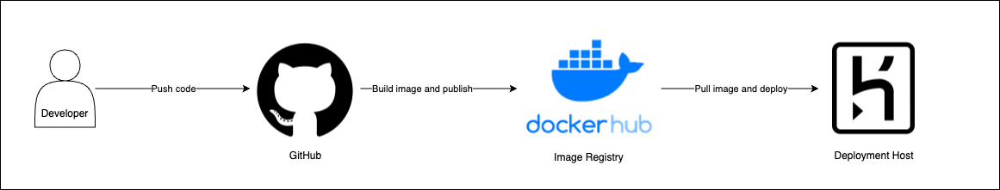
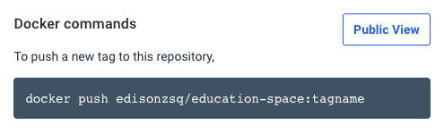
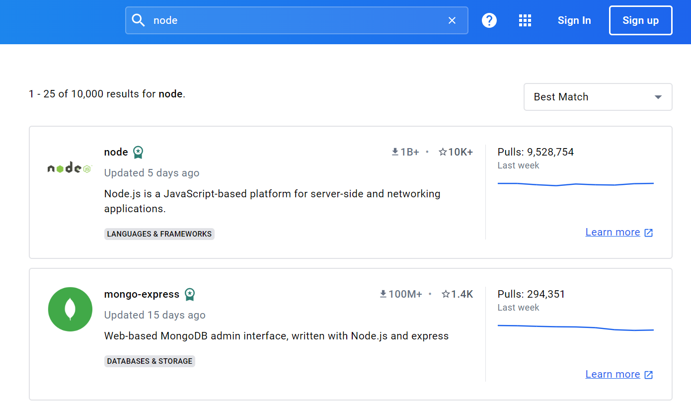
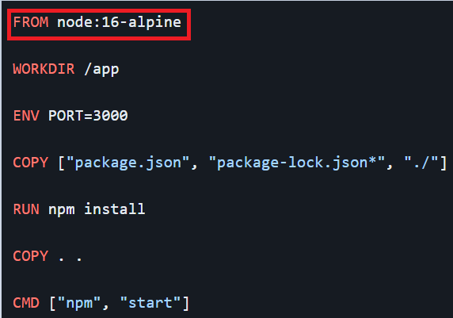

# Containerization - Remote Registries

## Learning Objective
1. Know what is a Container Image Registry
2. Push and pull images from the image registry
3. Understand t

## Cloud Native Applications

In the previous lesson, we started learning about containerization and hosting a docker container locally. We have also experienced what it meant by building images and deploying them locally using docker run. In this lesson, we will go deeper into understanding Clound Native Apps and Container Registry.

The quick answer to what makes an app cloud native are simply use of container technology or serverless. This is only half true because there are qualities in how "cloud native" your application is. To migrate a traditional software into cloud native applications is not easy feat. Some migrations can take months and years to complete.

Instead of nailing the practical outcomes such as containerization/serverless, we can focus on understanding the principles of cloud native app. As a Cloud/DevOps Engineer, the details of how the software is written may not be your top priority. However, it is important for you to learn to discern how ready is a piece of software to be cloud native.

1. Single Concern - Every container should address a single concern and do it well.
2. High Observability - Containerized applications must provide APIs for system health checks and logging.
3. Lifecycle Conformance - Containers be able to read events and be able to conform and react to those events. Sample events include PreStart, PostStop, SIGTERM (Terminate Signal) and SIGKILL (Kill Signal).
4. Image Immutability - Containers should be immutable and should not change between different environments.
5. Process Disposability - Containers should be disposable / recyclable, meaning, they can be replaced by another container instance at any point in time.
6. Self Containment - Containers should contain everything it needs at build time. It should rely only on the presence of the Linux kernel and any other libraries / dependencies at the time it is built.
7. Runtime Confinement - Every container should declare its resource requirements and pass that information to the platform, and adhere to the said requirements.

## Container Image Registry

A container registry acts as a place to store container images and share them out via a process of uploading (pushing) to the registry and downloading (pulling) into another system. Once you pull the image, the application within it can be run on that system.

Consider this logical flow:



1. Developers push code to the code version control system called GitHub
2. When code changes are detected in the GitHub, the system would:
    - Clone the repository
    - Perform image build
    - Publish image to image registry
3. When the deployment step is triggered, it would pull the image from registry and deploy it.

[Docker Hub](https://hub.docker.com/) is a service provided by Docker as a container image registry for finding and sharing container images. We will need an account to utilize the `docker push` and `docker pull` commands to manage images in Docker Hub Repository.

### DockerHub Account Creation

Step 1: Go to [Docker Hub](https://hub.docker.com/) to register a new account, or sign in to existing account. It is preferred to use email credentials to sign up for DockerHub.

Step 2: Ensure that your Docker Desktop is signed in to the Docker Hub. Go to Docker Dashboard > Images > Remote Repositories to sign in.

### Create Docker Hub Registry

Step 1: In Docker Hub, click on "Create Repository".

Step 2: Name the repository `education-space`, insert any description and select "Public" repository.

Step 3: Once the registry is created, there will be an instruction on the right that indicate you must push your image based on this convention: `your_username/repository_name:tagname`. 



### Tagging Images and Pushing to Image Registry

*Pre-work: Modify the App.js in se-sample-container to include your name and rebuild the image.*

The image name should follow the convention `your_username/repository_name` to be able to push to the remote repository. This can be done in two ways: 
1. Build from `Dockerfile` from scratch and name the `-t` options appropriately
2. Re-tag existing image.

For example, if the image has a tag called `apple:latest`, the image can be retagged by entering the command:

```sh
docker image tag apple:latest <your dockerhub account>/education-space:latest
```

Then, push the image to the registry with:

```sh
docker push <your dockerhub account>/education-space:latest
```

and there will be a new image recorded in Docker Hub. 


If you do not wish to use `docker image tag` command, you would simply build a new image through `Dockerfile` using:

```sh
docker build -t <your dockerhub account>/education-space:latest .
```

> Note: In production, it is generally a bad idea to tag `:latest` for every image you publish. The tag would typically reflect semantic versioning convention such as `:1.0.0`. In real world use cases, there would be one Docker Hub Repository to store all images built from a single code base

### Pulling images from the registry

Pulling images allows downloading of a particular image, or set of images. This is done via the `docker pull` command.

```sh
docker pull <your dockerhub account>/education-space:latest
```

After downloading, the image can be run using the `docker run` command.

```sh
docker run <your dockerhub account>/education-space:latest
```

Pushing and pulling images to image registries allows developers to share images without any need of setup, hence solving the problem of "it works on my machine" by having the Dockerfile setup the image.

## Docker Hub Images

The Docker Hub repository is not only a storage for our application images; it also contains images that used to setup the environment for our Dockerfiles.



These images are used in our Dockerfiles using the `FROM` keyword.



## Semantic Versioning

In the automated deployment process, known as Continuous Deployment, it needs to identify which image to pull from registry to deploy them. The unique identifier of the images are `tags`, which are typically version number. The most common versioning approach is `Semantic Versioning`. In short, [SemVer](https://semver.org/).

The versioning format is `MAJOR.MINOR.PATCH` (example: `2.1.5`).

1. MAJOR version when you make incompatible API changes
1. MINOR version when you add functionality in a backwards compatible manner
1. PATCH version when you make backwards compatible bug fixes

Other versioning terms based on the software release cycle include the following:

1. Alpha - the features are still incomplete and continuous testing of core elements is needed.
2. Beta - the software is tested by a larger group of users, typically outside of the organization that developed it.
3. RC (Release Candidate) - all product features have been designed, coded, and tested through one or more beta cycles with no known significant bugs.