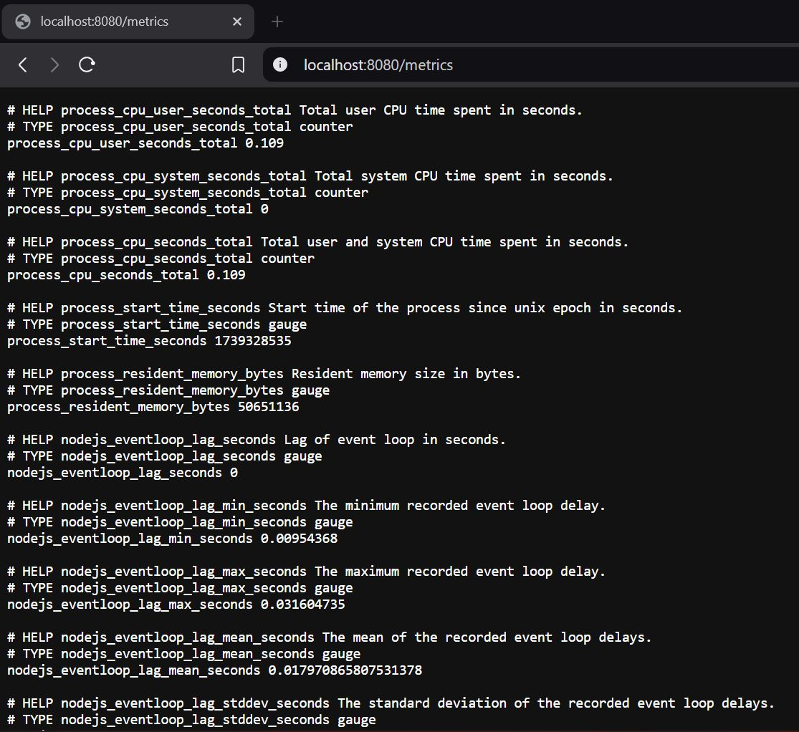

# Monitoring

## Learning Objectives
1. Understand what monitoring is and why is it used
2. Use Prometheus to look at site metrics

## Monitoring

Continuous Monitoring (CM), sometimes called Continuous Control Monitoring (CCM), is an automated process by which DevOps personnel can observe and detect compliance issues and security threats during each phase of the DevOps pipeline. It helps teams or organizations monitor, detect, study key relevant metrics, and find ways to resolve said issues in real time.

### Types of Monitoring

A all-covering approach is a key strategy and vital in monitoring and managing an organization’s digital environments effectively. Continuous monitoring incorporates several key types:

1. Infrastructure Monitoring -  It involves collecting and analyzing data from systems, processes, and IT infrastructure to enhance performance, availability, and security. 
2. Application Monitoring - It focuses on the performance and security of applications. Its primary objective is to  identify and resolve issues before they affect functionality.
3. Network Monitoring - It targets the performance and security of network components, aiming to spot potential threats and safeguarding against interruptions and vulnerabilities.

### Benefits of Monitoring

1. Observability: Provides insights into application health, resource usage, and system performance.
2. Troubleshooting: Helps diagnose and resolve failures efficiently.
3. Auto-scaling: Kubernetes uses monitoring data to scale pods dynamically.
4. Compliance & Security: Ensures systems adhere to performance and security policies.

### Monitoring Tools

There are many different monitoring tools that allow teams to monitor different aspects of the systems. For containers, these are some of the tools and their functions:
1. Prometheus - Industry-standard for time-series metrics.
2. Grafana - Visualization tool for Prometheus data.
3. ELK Stack (Elasticsearch, Logstash, Kibana) - Logs-based observability.
4. Datadog, New Relic, AWS CloudWatch - Managed monitoring solutions.
5. Micrometer - Instrumentation facade for observability

## Prometheus

Prometheus is an open-source systems monitoring and alerting toolkit originally built at SoundCloud. Prometheus collects and stores its metrics via HTTP endpoints as time series data, i.e. metrics information is stored with the timestamp at which it was recorded, alongside optional key-value pairs called labels. And it uses PromQL, a powerful query language.

Key Components of Prometheus
1. Prometheus Server: Scrapes and stores metrics.
2. Exporters: Convert metrics into Prometheus-compatible format.
3. Alertmanager: Handles alerts (integrates with email, Slack, etc.).
4. Pushgateway: Enables short-lived jobs to expose metrics.
5. Grafana (Optional): Used for visualizing metrics.

### Local Prometheus Setup (ExpressJS)

Prometheus can be use to measure the metrics of our backend applications. This [repository](https://github.com/SkillsUnion/se_sample_monitor) is an example to the code in JS that uses Prometheus packages.

Check out the `final` branch's `index.js` to see how Prometheus was used as a middleware to collect metrics.

To see how this app works, simply do the following commands:
```sh
npm install
npm start
```

And to access the metrics, go to your browser and access `localhost:8080/metrics`. It would read through and show the times for the application.



*Note: the default endpoint for Prometheus metrics is `/metrics`.*

### Prometheus YAML

How Prometheus knows how or what to scrap is based on its configuration file in the image that it uses. Its configuration file is in `prometheus.yml`. Below is an example of how a sample `prometheus.yml` config file looks like:

```yml

global:
  scrape_interval: 15s # By default, scrape targets every 15 seconds.

# Configuration for scraping individual services
scrape_configs:

  # Configuration for scraping Prometheus itself
  - job_name: 'prometheus'
    dns_sd_configs:
      - names: ['RENDER_SERVICE_NAME-discovery']
        port: 9090
        type: A # Render service discovery uses A records
        refresh_interval: 5s # Refresh the list of targets every 5 seconds
```

Here are more details regarding the fields in the scrape configs:

1. job_name - A unique name for the job. it is recommended using the name of the service you’re scraping.
2. names - the target service’s discovery hostname.Prometheus uses the hostname to obtain the IP address for each running instance of the target service. 
3. port - The port on which the service exposes its metrics endpoint.
4. type - Type of records Prometheus uses.
5. refresh_interval - How often Prometheus should refresh the list of targets.
6. metircs_path - The path of the target service’s metrics endpoint. The default value is `/metrics`.

More details can be found in Prometheus' [documentation](https://prometheus.io/docs/prometheus/latest/configuration/configuration/).

### Prometheus on Render (Optional)

Typically, we would do monitoring on hosted applications, and each instance of the service. However, this would incur costs as the hosting service would need storage to log the measured metrics. 

For this example, we would follow how to setup Prometheus on Render, but you can skip this part as you need to create services that would not be free.

Here is the [guide](https://render.com/docs/deploy-prometheus) on how to deploy Prometheus using Render.

