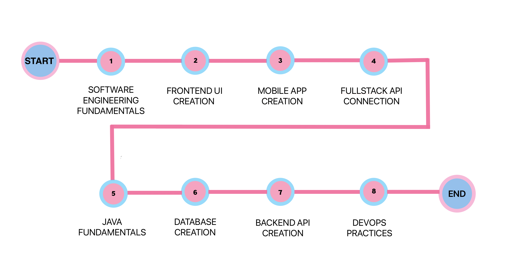

# Software Engineering Programme Roadmap

---

The following roadmap shows all the major topics that will covered in the Software Engineering Programme. The next section would discuss what we will be covering throughout the programme.

## **1. SOFTWARE ENGINEERING FUNDAMENTALS**
**Learning Objective:**  
Gain knowledge on tools that software engineers use day-to-day to create applications

- **Git Fundamentals**: Learn how to setup a version control system for projects using Git
- **Command Line Fundamentals**: Master basic command line navigation commands
- **Environment Setup**: Install and setup tools that would serve as the coding environment

---

## **2. FRONTEND UI CREATION**
**Learning Objective:**  
Develop proficiency in languages used in UI creation.

- **HTML and CSS**: Learn how to create the structure and layout of webpages using HTML and CSS
- **JavaScript Fundamentals**: Learn basic programming logic using JavaScript, a popular scripting language for web applications
- **NodeJS**: Learn how to create client-side applications using NodeJS
- **ReactJS**: Learn how to create Single-Page Applications (SPA) using ReactJS, a popular frontend framework used by companies like Meta and Netflix
- **Deployment**: Learn how to deploy React projects using online hosting platforms

---

## **3. MOBILE APP CREATION**
**Learning Objective:**  
Gain hands-on experience with creating basic mobile applications

- **React Native and Expo**: Learn how to create simple mobile applications using the phone's functionalities using React Native and Expo's external libraries

---

## **4. FULL-STACK API CONNECTION**
**Learning Objective:**  
Learn how to set up and manage connections to APIs to retrieve data

- **HTTP Requests and Responses**: Learn how to connect to APIs by sending requests and receiving responses using Axios
- **Advanced React Topics**: Learn about Routing and React app optimization techniques
- **Firebase**: Learn how to create a simple backend with storage and authentication using Firebase

---

## **5. JAVA FUNDAMENTALS**
**Learning Objective:**  
Learn about Object-Oriented Programming using Java

- **Java Fundamentals**: Learn the syntax of Java and provide comparison to languages such as JavaScript
- **Object-Oriented Programming**: Learn about the concepts of Object-Oriented programming to create classes and objects for code organization and reusability

---

## **6. DATABASE CREATION**
**Learning Objective:**  
Understand how to build databases and manage data in them.

- **Relational Databases**: Understand what Relational Databases are
- **SQL**: Learn how to create databases and tables and manage relationships and data

---

## **7. BACKEND API CREATION**
**Learning Objective:**  
Learn how to create APIs for frontend applications to connect to.

- **RESTful APIs**: Learn about the concept of RESTful services
- **SpringBoot**: Create APIs using Java's SpringBoot framework
- **ORMs**: Connect and model databases for API use using Object Relational Models
- **Test Driven Development**: Learn an approach to code development by creating tests for functionalities

---

## **8. DEVOPS PRACTICES**
**Lesson Objective:**  
Learn the principles of DevOps to automate and streamline development, testing, and deployment processes.

- **Agile and Scrum**: Learn about the Agile mindset and implement one of the most popular Agile methodologies, Scrum.
- **Containerization**: Learn how to containerize applications using Docker
- **CI/CD**: Learn about automation and deployment to hosting platforms using CI/CD pipelines 
- **Security**: Learn about basic web security and vulnerability scanning

---

By following the Software Engineering Path, learners will gain an understanding of software development, tools, automation, and deployment strategies, preparing them for roles in the rapidly evolving field of software engineering.